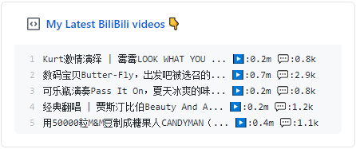

  
  <h3 align="center">Bilibili-box</h3>
  
Update a pinned gist to contain the latest videos of a user

---

> 📌✨ For more pinned-gist projects like this one, check out: https://github.com/matchai/awesome-pinned-gists

## Setup

English | [中文](./readme.zh.md)

### Prep work

1. Create a new public GitHub Gist (https://gist.github.com/)
1. Create an access token with the `gist` scope and copy it. (https://github.com/settings/tokens/new)
1. Find UID in Bilibili personal space link (https://space.bilibili.com/37728693)

### Project setup

1. Fork this repo
1. Edit the [environment variables](https://github.com/KeJunMao/bilibili-box/blob/master/.github/workflows/main.yml#L27-L28) in `.github/workflows/schedule.yml`:

   - **UID:** The user handle of the bilibili account.
   - **GIST_ID:** The ID portion from your gist url: `https://gist.github.com/matchai/`**`6d5f84419863089a167387da62dd7081`**.

1. Go to the repo **Settings > Secrets**
1. Add the following environment variables:
   - **GH_TOKEN:** The GitHub access token generated above.

修改UID,这个东西不是直播间的ID，而是你个人资料上面的ID
项目run 成功之后Gitst上面也生成了相应的数据，但是pin了之后上面就显示项目名称没有显示项目内容，后面发现项目里面有三个文件，后面我把其他两个文件都给删除了，只保留一个，这样子就可以在主页上面看到Bilibili的稿件信息了